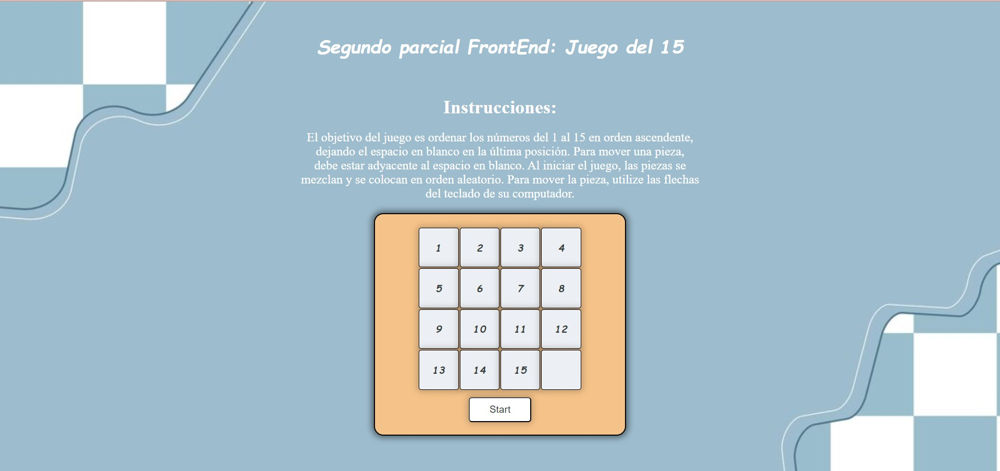

# Juego del 15
### Description
Developed a game using Vanilla, Javascript, HTML, CSS.

## Instructions
1. Clone the repository
2. Open Visual Studio Code
3. Open a terminal and run:
`npm run dev`
4. Clic into the local path: `http://127.0.0.1:5173/`
5. In order to start playing, you need to press the Start button.
6. Use the arrows on your keyboard to control the blank space.

### Result

